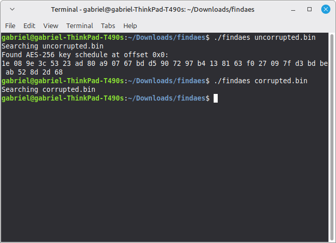
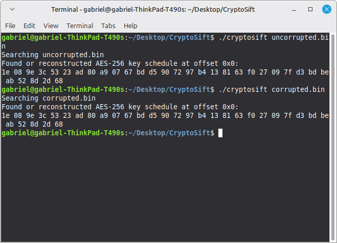

# CryptoSift
A program to find or reconstruct AES key schedules and export them to binary files

## How to use

Assuming a Unix or Unix-like system with a version of `make`, simply run `make` followed by

`./cryptosift [LIST OF FILES TO SEARCh]`

The next step in the development of this program will be the ability to export the found or
reconstructed keys to binary files in a specified directory.

## Proof of reconstruction capabilities

Here is a screenshot demonstrating the inability of the original `findaes` to reconstruct a
corrupted key schedule.

And here is a screenshot demonstrating the ability of `cryptosift` to successfully reconstruct
a corrupted key schedule.

